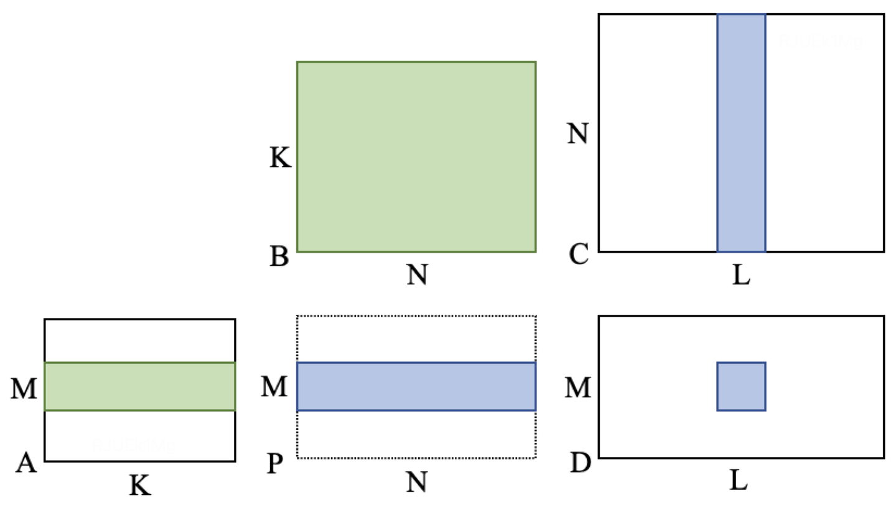
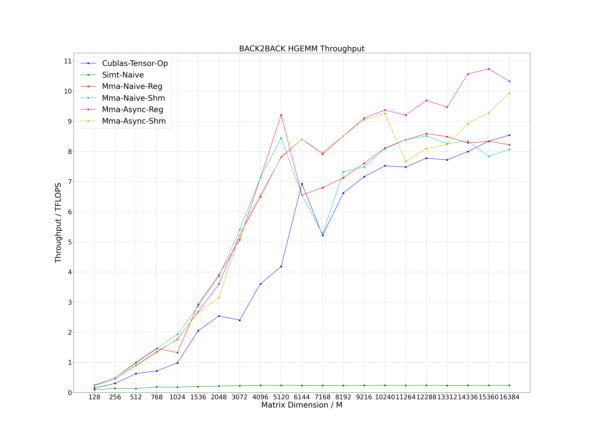
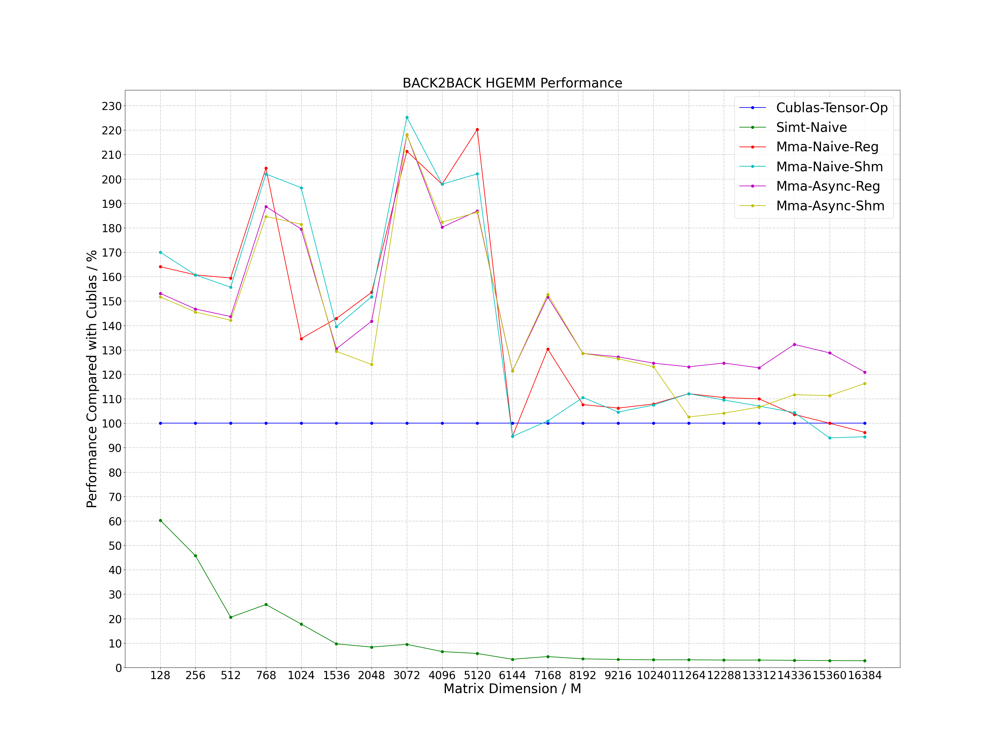

# CUDA BACK2BACK HGEMM
Use tensor core to calculate back-to-back HGEMM (half-precision general matrix multiplication) with MMA PTX instruction. The calculation expression is as follows, where the precision of matrix A (M * K), B (K * N), C (N * L) and D (M * L) is FP16. Tested in special scenarios, the performance can exceed cublas performance by 20% to 120%.
```
D (M * L) = A (M * K) * B (K * N) * C (N * L)
HGEMM0: P (M * N) = A (M * K) * B (K * N)
HGEMM1: D (M * L) = P (M * N) * C (N * L)
```



# Optimization Method
- Simt Naive: naive algorithm using cuda core
- Mma Naive Reg: naive algorithm using tensor core and transfer the intermediate results through shared memeory
- Mma Naive Shm: naive algorithm using tensor core and transfer the intermediate results through register
- Mma Async Reg: async algorithm using tensor core and transfer the intermediate results through shared memeory
- Mma Async Shm: async algorithm using tensor core and transfer the intermediate results through register

# Compile
## Environment
- OS: Linux
- Cmake Version: >= 3.12
- GCC Version: >= 4.8
- CUDA Version: >= 11.0
- Gflags: install on ubuntu as follows
```
sudo apt-get install libgflags-dev
```

## Clone
```
git clone https://github.com/Bruce-Lee-LY/cuda_back2back_hgemm.git
```

## Build
### NVIDIA A100
```
cd cuda_back2back_hgemm
./build.sh -a 80 -t Release -b OFF
./build.sh -a 80 -t Debug -b OFF
```

### RTX3080Ti / RTX3090 / RTX A6000
```
cd cuda_back2back_hgemm
./build.sh -a 86 -t Release -b OFF
./build.sh -a 86 -t Debug -b OFF
```

# Run Sample
```
./run_sample.sh
```

# Performance
Process the data in the log and plot it as a line chart.

```
cd tools/performance
./performance.sh
```

## RTX3090
- CUDA Version: 11.8
```
L = 8
N = 16
K = 512
```

Performance achieved by current optimization methods.





# TODO
Currently only supports N=16 back-to-back HGEMM.
- N = 32, 64, 128 etc.
